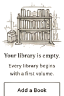
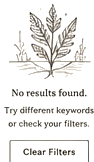
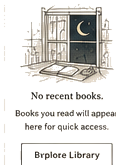
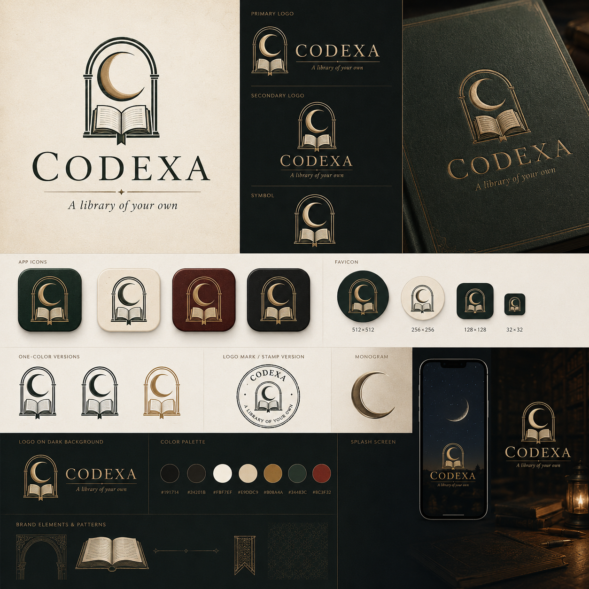

<div align="center">


### Your library, your own.

**Codexa** turns the books you already keep in Google Drive into a private,
offline-first reading library — with real downloads, real reading progress, and
no server in between.

[](https://flutter.dev)
[](https://dart.dev)
[](#install--try-it)
[](#development)
[](https://github.com/Aminh0o/codexa/actions)
[](https://github.com/Aminh0o/codexa/releases)

**[Download the Android build →](https://github.com/Aminh0o/codexa/releases/tag/v1.0.0)**

</div>

---

## Why Codexa

Most reading apps put your books behind someone else's catalogue, account, and
business model. Codexa takes the opposite position: **your Drive folders are
already a library**, and the app is simply a serious reading client for them.
Everything you download, every bookmark and page position stays on your device.

## What it does

| | |
|---|---|
| **Offline-first** | The library, search, bookmarks and reader are served from a local SQLite database. Airplane mode changes nothing about reading. |
| **Drive as source** | Sign in with Google, pick a folder, and Codexa mirrors it as books and chapters — including PDF metadata and cover extraction. |
| **Honest downloads** | A real download queue with progress, pause, resume and cancel. Paused stays paused, cancelled stays re-downloadable, and only a genuine error is ever reported as failed. |
| **Pick up where you left off** | Page position and reading progress are stored per document and restored on reopen, online or offline. |
| **Non-destructive by design** | "Remove downloads" frees device storage and keeps the book. Nothing is ever deleted from your Google Drive. |
| **Three languages** | Arabic (default, full RTL), English and French — with light, dark and system themes. |
| **Responsive** | Widths, margins, card grids and dialogs scale from a single set of phone / tablet / desktop breakpoints. |

## How it works

```
Google Drive ──list/mirror──▶ SQLite (books · documents · sections) ──▶ UI (Riverpod)
                                   │
                        local files  ├── reading progress
                     (PDF on disk)   └── bookmarks
```

* A Drive folder maps to a **book**, subfolders to **sections**, PDF files to **documents**.
* Sync is conservative: a successful-but-empty listing never wipes a book, and a document that is **fully downloaded locally is never deleted** just because Drive stopped reporting it.
* Storage totals are recomputed atomically in the same transaction that removes a download, so Settings never shows stale numbers.
* Metadata conflicts resolve deterministically — one authoritative source per field, applied in a single atomic merge.

## Design

Codexa ships with its own design system: a Bodoni Moda display face against
Literata and Hanken Grotesk for text, Noto Naskh Arabic for Arabic, an
archival parchment-and-ink palette, and hand-drawn empty states.

 &nbsp;
 &nbsp;
 &nbsp;


<div align="center">
  
</div>

The full specification — palette, type scale, iconography, badges and empty-state
illustration — lives in
[`conception/Codexa_Design_System.md`](conception/Codexa_Design_System.md), with
the product requirements in
[`conception/Codexa_PRD_v1.1.md`](conception/Codexa_PRD_v1.1.md).

## Install & try it

1. Grab `codexa-v1.0.0.apk` from the [latest release](https://github.com/Aminh0o/codexa/releases/tag/v1.0.0).
2. Install it (Android will ask to allow apps from this source — expected for a direct APK).
3. Sign in with the Google account that holds your books, then add a Drive folder.

Requires Android 7.0 (API 24) or newer. The release build is signed with the
project's release key, and its SHA-1 fingerprint must be registered in your
Firebase / Google Cloud OAuth client for sign-in to work — see
[Google setup](#google-setup).

## Development

```bash
git clone https://github.com/Aminh0o/codexa.git
cd codexa
flutter pub get
flutter run
```

Build artefacts:

```bash
flutter build apk --release    # Android
flutter build ios --release    # iOS
flutter test                   # unit + widget tests
flutter analyze                # static analysis
```

For release signing, create `android/key.properties` (git-ignored) pointing at
your keystore, plus `android/app/release-key.jks`. Without it the release build
falls back to debug signing.

### Google setup

Codexa uses Google Sign-In and the Drive API, so it needs your own Firebase /
Google Cloud project. Credentials are **not** committed to this repository:

1. Create a Firebase / Google Cloud project and enable the Drive API.
2. Add an Android app with package name `com.codexa.codexa`.
3. Register **both** the debug and release SHA-1 fingerprints of the keystores
   you build with, and add a web OAuth client.
4. Copy the downloaded config into place and set your web client id:

```bash
cp android/app/google-services.example.json android/app/google-services.json
# then replace the placeholders with your own values, and update
# _webClientId in lib/data/datasources/google_auth_service.dart
```

`google-services.json` is git-ignored on purpose — it carries your OAuth client
ids and API key. Continuous integration reads it from the
`GOOGLE_SERVICES_JSON` repository secret and falls back to the template.

A keystore fingerprint that is not registered shows up as `DEVELOPER_ERROR`,
which the app reports as "Sign-in is not configured".

## Project layout

```
lib/
├── core/           theme, typography, constants, localization (ar/en/fr)
├── data/
│   ├── database/   SQLite schema, migrations, atomic helpers
│   ├── datasources/ Google Drive + Google Sign-In clients
│   ├── repositories/ books, downloads, reading progress
│   └── services/   sync engine, PDF metadata and search
├── domain/         models
├── presentation/   screens, navigation, widgets
└── providers/      Riverpod wiring
```

## Tech stack

Flutter · Dart · Riverpod · SQLite (`sqflite`) · Google Drive v3 REST ·
`google_sign_in` · `pdfrx` · `flutter_secure_storage` · Lucide icons

## Quality

* CI runs analyze, tests and a release build on every push and pull request.
* Regression coverage targets the risky parts: sync merge atomicity, discovery
  safety, download state transitions, and storage accounting.

## License

All rights reserved. Codexa is a personal project; the design system and brand
assets are included in this repository for reference.
